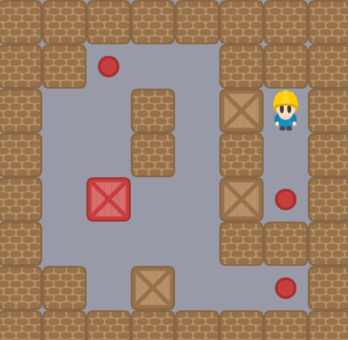

# PyQt5 Sokoban

Réalisation d'un Sokoban (jeu de puzzle) en Python avec le module PyQt5.

- 4 niveaux
- Déplacement des caisses et colisions
- Superposition des caisses et points de placement
- Compteur de mouvement
- Différents effets sonores



## Lancer le projet 

Prérequis `PyQt5`

```sh 
python3 main.py
```
